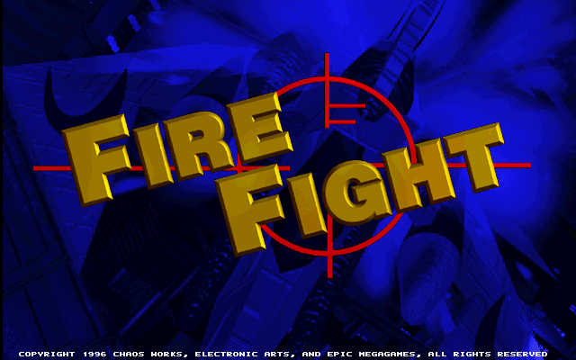
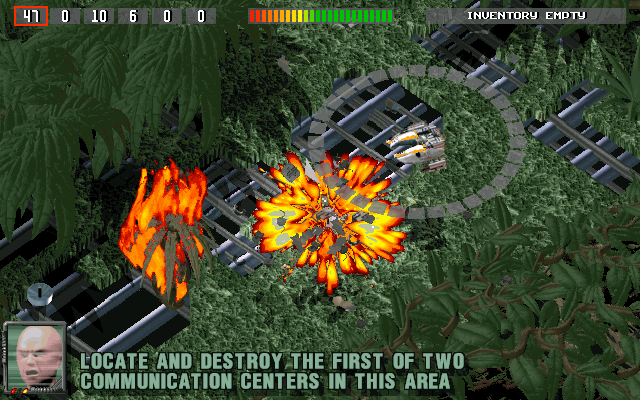
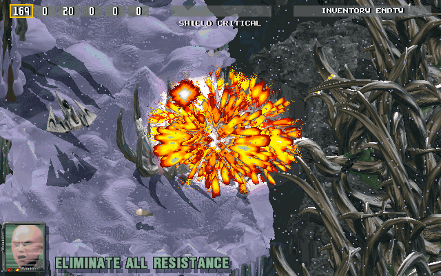
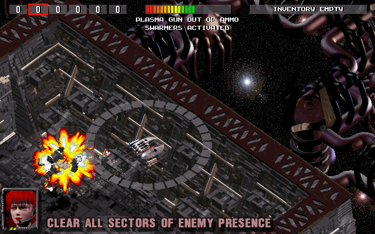
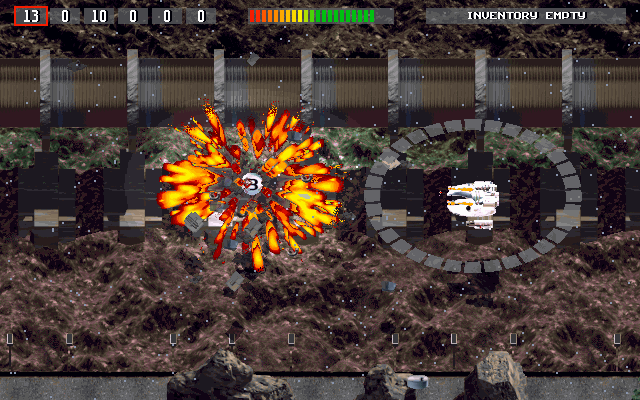
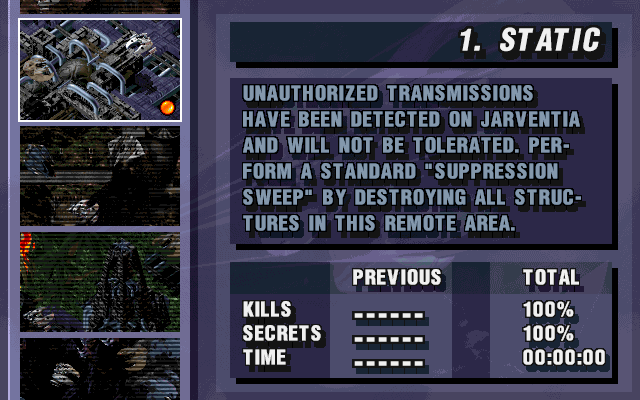
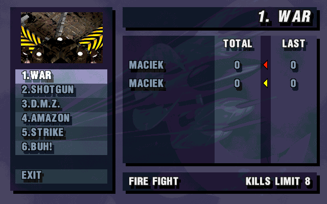

# Fire Fight



**Fire Fight** is a top-down shooter for Windows 95, made in 1996 by **Chaos Works**, a studio from Kraków, Poland. Published by Electronic Arts and Epic MegaGames, it was the first Polish game released by **Electronic Arts**.

This repository keeps the game's original source code and data, and ports it to today's tools and systems, Windows, Linux and macOS, thirty years after its release.

<table>
  <tr>
    <td><br><sub>Jungle: destroying a communication centre</sub></td>
    <td><br><sub>Ice: eliminating all resistance</sub></td>
  </tr>
  <tr>
    <td><br><sub>A space station</sub></td>
    <td><br><sub>An industrial wasteland</sub></td>
  </tr>
  <tr>
    <td><br><sub>The mission screen</sub></td>
    <td><br><sub>Choosing a map for a network game</sub></td>
  </tr>
</table>

## The game

You fly an armed ship over pre-rendered worlds: jungles, ice fields, industrial wastelands and space stations. The campaign has 18 missions across the planets Darius, Jarventia and Ch'ok, putting down uprisings against the Phantom Council. Missions ask for more than shooting: destroying communication centres, collecting containers, capturing enemies, finding secret places.

- Six weapons: vulcan, swarmers, plasma gun, missiles, cannon and grenades, plus items such as shield restores, a cloaking device and mines.
- Spoken radio dialogue during the missions, and a CD soundtrack by Janusz Pelc.
- Network games for up to four players on six maps: *fire fight* (a deathmatch to a kills limit or a time limit) and *base building*.
- Keyboard, mouse steering or a game controller.

## About this repository

Fire Fight was made by Chaos Works, a studio I co-founded; that is why I have the game's source code and data.

Some time ago I tried to find out who holds the rights to the title, without success. The publishing contract was signed by fax, so it had no chance of surviving. The studio has not existed since the late 1990s, Epic has no electronic copy of the contract, and I could not get in touch with Electronic Arts.

Thirty years after the release, I decided, for the sake of game preservation, to use modern AI tools to port the game to current tools and platforms. The port is being written with Claude Code, Anthropic's AI coding assistant, under my direction. It runs the original 1996 code with as few changes as possible, and checks itself against the original: the attract-mode demos recorded in 1996 replay in perfect sync on every platform.

If you hold rights to Fire Fight and object to this repository, write to me at **maciek@miasik.net** and I will take the material down.

*Maciej Miąsik*

## Status

- **Single player** works: graphics, sound, the soundtrack, keyboard, mouse and game controllers.
- **Network play** works on a local network. Internet play is not there yet.
- **In a web browser**, single player works too, so far tried in Chrome and Safari (see [Download](#in-a-web-browser)).
- **Not yet:** in-game menus for key bindings and network games (the original had a separate launcher for these).

The port's progress, and how it was done, is in [`docs/porting.md`](docs/porting.md).

## Download

Ready-made packages for Windows, Linux and macOS are on the [Releases](https://github.com/tosiabunio/firefight-port/releases) page, from version 0.7.0. Each holds the game, its data and the soundtrack, about 260 MB.

- **Windows 10 or 11 (64-bit):** unzip and run `firefight.exe`. Windows may warn about an unrecognised app: choose *More info*, then *Run anyway*.
- **Linux (64-bit, glibc 2.39 or newer: Ubuntu 24.04, Fedora 40 and later):** unpack and run `./firefight`.
- **macOS 11 or newer, Apple Silicon:** open the disk image and drag *Fire Fight* to *Applications*. The app is not notarised, so the first time macOS refuses to open it; allow it in *System Settings → Privacy & Security* (*Open Anyway*).

### In a web browser

Play at [tosiabunio.github.io/firefight-port](https://tosiabunio.github.io/firefight-port/), with nothing to install. It runs best in Chrome or Edge 137, Firefox 153 or Safari 27, or newer. Older browsers, back to Chrome 95, Firefox 100 and Safari 15.2, get a larger and slower version of the game, so far tried only in Chrome. The first visit downloads about 50 MB; the soundtrack comes in the background, so the game can start before all of it has arrived.

The web version is new. It runs the same code as the desktop version, built as WebAssembly.

- **Works, tried in Chrome and Safari 27 on macOS:**
  - the title sequence, the attract-mode demos and the first mission;
  - the keyboard and mouse steering;
  - the sound and the soundtrack;
  - the in-game menus;
  - saving: the browser keeps the settings and the pilots between visits;
  - the recorded demos replay in perfect sync, as they do on the desktop.
- **Not checked yet:** game controllers, and Firefox.
- **Not there yet:** network play. It will come with internet play, through a relay server.

In a browser:
- The game pauses while its tab or window is not in front, as the desktop version pauses when its window loses the focus.
- While the game runs, closing or reloading the page asks for confirmation. On Windows and Linux, Ctrl+W closes a tab, and Ctrl is the secondary fire key.
- To quit, use the menu: Esc, then *Mission*, *Quit Game*. On macOS, Cmd+Q quits the browser itself.
- The settings and pilots are stored by the browser for this site, so clearing the site's data removes them.
- Options go in the address: `?stretch` shows the picture at 4:3, and `?demo=level1` plays one recorded demo.

## Building from source

The repository contains everything the game needs, including its data and soundtrack.

**You need** CMake 3.25 or newer, Ninja, a C++17 compiler, and [vcpkg](https://github.com/microsoft/vcpkg) with the `VCPKG_ROOT` environment variable pointing at it. vcpkg builds SDL2, SDL2_mixer and ENet on the first configure, which takes a few minutes.

- **Windows:** Visual Studio 2022 or its Build Tools, with the *Desktop development with C++* workload. It includes CMake, Ninja and vcpkg. Build from an *x64 Developer PowerShell*; `VCPKG_ROOT` can be the bundled `…\Microsoft Visual Studio\2022\<edition>\VC\vcpkg`.
- **Linux:** GCC or Clang, `ninja-build`, and the X11, Wayland and audio development packages SDL needs. The CI workflow (`.github/workflows/ci.yml`) has the exact package list for Ubuntu.
- **macOS (Apple Silicon):** the Xcode Command Line Tools and `brew install cmake ninja pkg-config autoconf automake libtool`.

```sh
git clone https://github.com/tosiabunio/firefight-port.git
cd firefight-port
cmake --preset linux-gcc                 # or windows-msvc, linux-clang, macos-clang
cmake --build --preset linux-gcc-release
```

Then run the game:

| System | Command |
|---|---|
| Windows | `build\windows-msvc\source\Release\firefight.exe` |
| Linux | `build/linux-gcc/source/Release/firefight` |
| macOS | `build/macos-clang/source/Release/firefight` |

The game finds its data and soundtrack in the repository by itself. Useful options:

- `--fullscreen`: full screen. Without it the game runs in a resizable window.
- `--stretch`: show the 640×400 picture at 4:3, as on a 1996 monitor, instead of square pixels.
- `--data <dir>`, `--music <dir>`: the game data and the soundtrack, if you move them.
- `--pref <dir>`: where settings, pilots, the log and screenshots go. By default that is the system's per-user application data folder.

## Controls

| Key | Action |
|---|---|
| Cursor keys or W, A, S, D | Forward, back, turn left, turn right |
| Space | Primary fire |
| Ctrl | Secondary fire |
| Z, X | Strafe left, right (or Alt with the turn keys) |
| Shift | Turbo; Caps Lock locks it |
| 1–6, Page Up, Page Down | Choose a weapon, previous, next |
| Keypad −, +, Enter | Previous item, next item, use item |
| F1 | Help, with all the keys |
| F2 | Current objective |
| F11 | Control device: keyboard, mouse or game controller |
| Esc | Menu: display, sound and music volume, controls |
| Pause | Pause |
| Alt+X (Cmd+Q on macOS) | Quit |

With mouse steering, the right button flies towards the pointer and the left button fires. With a game controller, the d-pad or the left stick steers, A fires and B is turbo.

## Network play

One player hosts, the others join:

```sh
firefight --host 2              # host a game for 2 to 4 players and wait for them
firefight --join 192.168.1.20   # join the game at that address
firefight --join lan            # or find it on the local network
```

The game uses UDP port 19960; `--port <port>` changes it. Once everyone has joined, the players choose a map together, and the game starts when all of them have accepted the same one.

## Credits

The original game, as listed in its end credits:

| Chaos Works | |
|---|---|
| Game Designer | Janusz Pelc |
| Graphic Artists | Rafal Trznadel, Michal Doniec |
| Lead Software Engineer | Janusz Pelc |
| Engine Programmers | Marek Sobol, Maciej Miasik |
| Game Programmers | Pawel Loj, Grzegorz Kunstman |
| Level Designers | Michal Doniec, Rafal Trznadel |
| Music | Janusz Pelc |
| Voices | Chris Minkiewicz, Matt Payne, Michael Paschal, Steve Greber |
| Voice Engineer | Wojciech Kus |
| Sound Editor | Maciej Miasik |
| Product Manager | Slawomir Puchalski |
| Special Thanks To | Marek Surowka, PC Duo Computers |

<details>
<summary>Electronic Arts and Epic MegaGames</summary>

| Electronic Arts | |
|---|---|
| Vice President of High Score Entertainment | Scott Orr |
| Executive Producer | Michael Pole |
| Producer | Happy Keller |
| Associate Producer | Tony Iuppa |
| Assistant Producers | Eric DeSantis, John Melchior, Michael Williams |
| Technical Director | Ken Zarifes |
| Audio Specialist | David Whittaker |
| Story | Eric DeSantis, John Melchior, Andrea Engstrom |
| Additional Artwork | Eric DeSantis |
| Product Manager | Albert Penello |
| Public Relations | Fiona Murphy |
| Documentation | Andrea Engstrom, Paul Armatta |
| Product Testing | Chris Bennett, Jim Donovan, Nate Wright, Dan Caraballo |
| Special Thanks To | Audrey Gustafson, Margaret Foley, Billy Schmitt |

| Epic MegaGames | |
|---|---|
| Marketing | Mark Rein |
| Producer | Doug Gibson |
| Computer Voice | Dianne Nola |
| Voice Engineer | Robert Allen |

</details>

The port: Maciej Miąsik, with Claude Code (2026).

## License

- **The code written for the port** (2026 onwards) is under the [0BSD license](LICENSE): use it for anything, no conditions.
- **The original Fire Fight** (the 1996 source code, data and soundtrack) is © 1996 Chaos Works, Electronic Arts and Epic MegaGames, as the game's own notice says. It comes with **no license**: it is here to preserve the game, and will be taken down if a rights holder asks (see [About this repository](#about-this-repository)).
